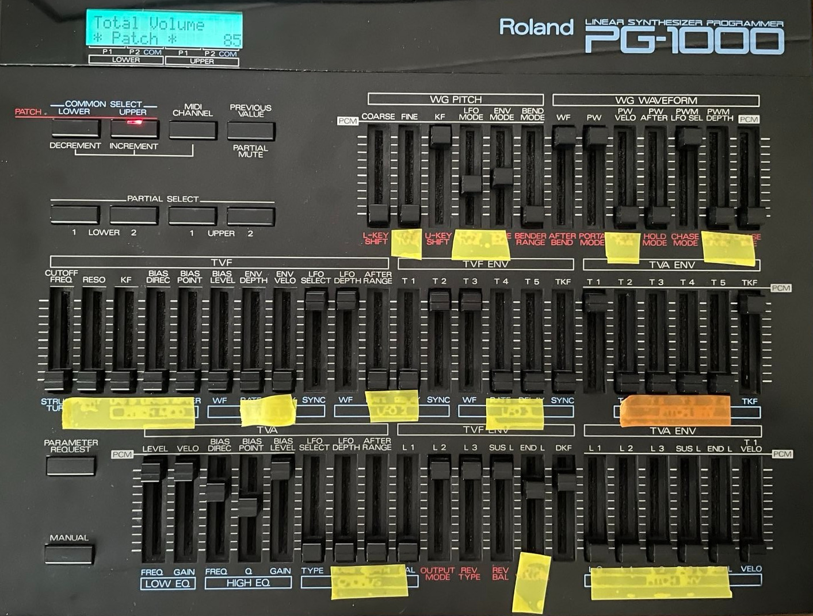

# pg1000cc

This program allows the use of a Roland PG-1000 as a MIDI controller sending CC messages.

Roland PG-1000 is the programming device, with a lot of sliders, for the Roland D-50 synth.
From way back (1986?). I have one, rarely use it for the intended purpose, and wanted to use
the sliders to control things in a DAW (Reaper), but turned out the PG-1000
sends MIDI SysEx messages instead of the CC messages that DAW's expect. This program
converts the SysEx messages to CC messages and allows the use of the sliders to control
DAWs (among other things).

Some of the sliders actually have a very limited resolution (like three values over the
whole range). I didn't want to use those. Here is a photo showing my PG-1000. The sliders
with the yellow tape are enabled and have a resolution of 100. The ones with orange tape
are enabled and have a resolution of 50. The rest are disabled.



Output range of all sliders after the CC conversion is 'standard' 0-127.

I use this in Linux. Not tested on anything else, but might even work, given the 
[MIDI crate](https://github.com/Boddlnagg/midir) used is cross-platform.

## Disclaimer

I wrote this purely for myself, to Make It Work. I do not expect that anyone else
would have use for this, at least without further productization. How many people
can there be that a) even have a PG-1000, b) use Linux for music creation and c)
can build Rust software? Well, in case the answer is more than one, I made this
repo public. Feel free to do what you want with it, but don't blame me if it
does not work for you.

## Building

[Install rust](https://www.rust-lang.org/tools/install). Then just `cargo build --release`.

You might need to install packages needed by the dependencies. I needed to `apt install libasound2-dev`.
  
## Running

```
$ target/debug/pg1000cc 
This program allows the use of a Roland PG-1000 as a MIDI controller sending CC messages.

NOTE: To work, set the PG-1000 in patch edit mode by pressing LOWER or UPPER button.

Available input ports:
0: Midi Through:Midi Through Port-0 14:0
1: MIDI4x4:MIDI4x4 Midi Out 1 20:0
2: MIDI4x4:MIDI4x4 Midi Out 2 20:1
3: MIDI4x4:MIDI4x4 Midi Out 3 20:2
4: MIDI4x4:MIDI4x4 Midi Out 4 20:3
Please select input port where PG-1000 is connected: 4


Opening connections
Connections open, forwarding from 'MIDI4x4:MIDI4x4 Midi Out 4 20:3' to 'pg1000cc' (press enter to exit) ...
[B1, 56, 1]
[B1, 56, 3]
```
